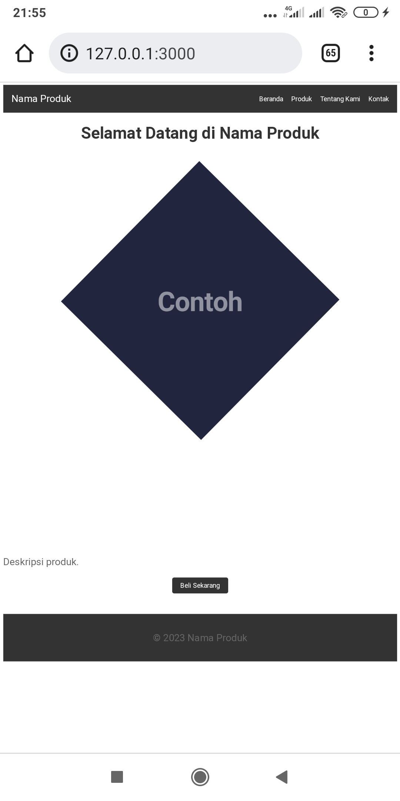
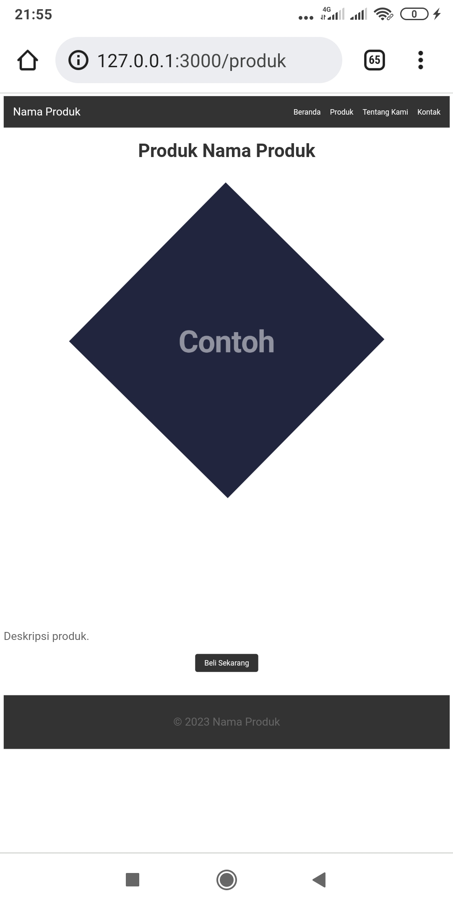
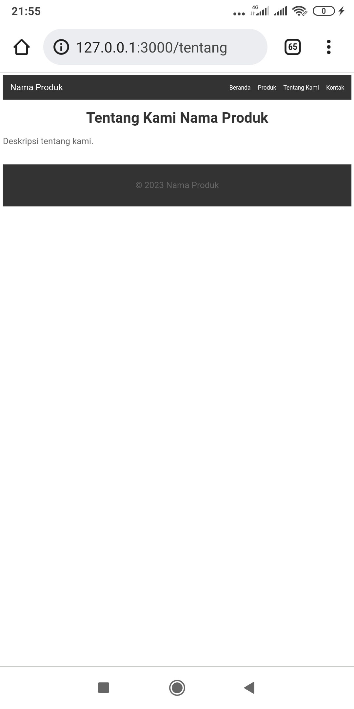
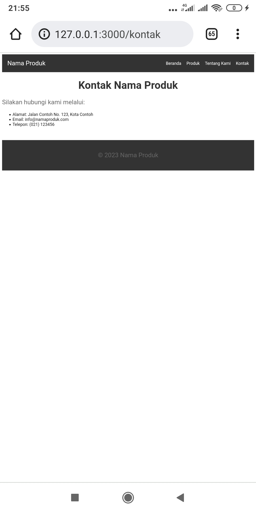

# simple-landing-page-nodejs
Simple landing page with nodejs html css 


## Instalation
Clone this project.
```
 git clone git@github.com:fajarjulyana/simple-landing-page-nodejs.git
```

Goto projects folder

```
cd simple-landing-page-nodejs
```
install package npm
```
npm install express
npm install ejs
```
run server.js

```
node server.js
```

## Capture
home <br/>
<br/>
produk <br/>
<br/>
tentang <br/>
<br/>
kontak <br/>
<br/>

thank
